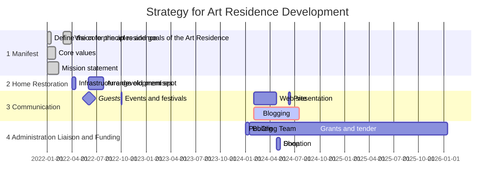

<!-- Add custom styles for Mermaid Gantt chart -->

<!-- Mermaid Gantt chart code -->
### 2  

```mermaid
---
displayMode: compact
---
gantt
  title Strategy for Art Residence Development
   %% This is a comment
  dateFormat YYYY
  section 1 Manifest
    Define the core principles and goals of the Art Residence: done, 2022-01-01, 14d
     Core values: done, 2022-01-01, 30d
    Mission statement: done, 2022-01-01, 6w
    Vision for the art residence: done, 2022-03-01, 30d
  section 2 Home Restoration
    Arrange old premises :  2022-06-01, 8w
    Infrastructure development spot: 2022-04-01, 15d
  section 3 Communication
    Web site:  site, 2024-02-01, 12w
    Blogging: crit, active, 2024-02-01, 24w
    Events and festivals: 2022-10-01, 2d
    Guests: milestone,2022-06-01, 5d
    Presentation: 2024-06-07, 1w
   section 4 Administration Liaison and Funding
     Building Team: team, 2024-01-01,2w
     PubOrg: 2024
     Grants and tender: after team, 2y
     Shop: after site, 2w
     Donation: 2024-02
```
