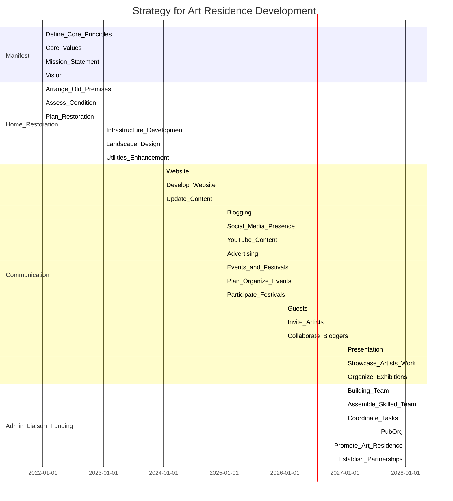
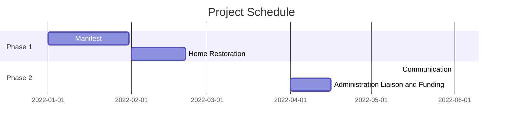

```mermaid
gantt
  title Strategy for Art Residence Development

  dateFormat YYYY
  section Manifest
    Define_Core_Principles :2022, 1yr
    Core_Values :2022, 1yr
    Mission_Statement :2022, 1yr
    Vision :2022, 1yr

  section Home_Restoration
    Arrange_Old_Premises :2022, 1yr
      Assess_Condition :2022, 6mo
      Plan_Restoration :2022, 6mo
    Infrastructure_Development :2023, 1yr
      Landscape_Design :2023, 6mo
      Utilities_Enhancement :2023, 6mo

  section Communication
    Website :2024, 1yr
      Develop_Website :2024, 6mo
      Update_Content :2024, 6mo
    Blogging :2025, 1yr
      Social_Media_Presence :2025, 4mo
      YouTube_Content :2025, 4mo
      Advertising :2025, 4mo
    Events_and_Festivals :2025, 1yr
      Plan_Organize_Events :2025, 6mo
      Participate_Festivals :2025, 6mo
    Guests :2026, 1yr
      Invite_Artists :2026, 6mo
      Collaborate_Bloggers :2026, 6mo
    Presentation :2027, 1yr
      Showcase_Artists_Work :2027, 6mo
      Organize_Exhibitions :2027, 6mo

  section Admin_Liaison_Funding
    Building_Team :2027, 1yr
      Assemble_Skilled_Team :2027, 6mo
      Coordinate_Tasks :2027, 6mo
    PubOrg :2028, 1yr
      Promote_Art_Residence :2028, 6mo
      Establish_Partnerships :2028, 6mo
```
# 2

```mermaid
gantt
  title Project Schedule
  dateFormat YYYY-MM-DD
  section Phase 1
    Manifest: 2022-01-01, 30d
    Home Restoration: 2022-02-01, 20d
  section Phase 2
    Communication :active,  des2,2022-06-01, 1yr
    Administration Liaison and Funding: 2022-04-01, 15d
```
