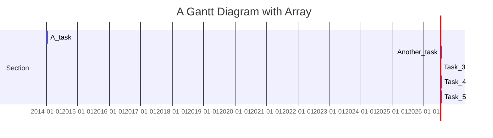

```mermaid
gantt
  title A Gantt Diagram with Array
  dateFormat YYYY-MM-DD
  section Section
    A_task :a1, 2014-01-01, 5d
    Another_task :after A_task, 7d
    Task_3 :after Another_task, 3d
    Task_4 :after Task_3, 6d
    Task_5 :after Task_4, 4d

```
