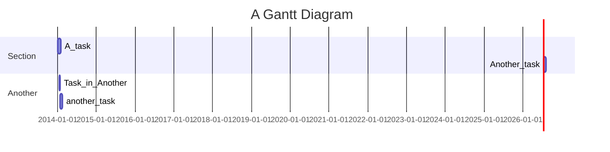

```mermaid
gantt
  title A Gantt Diagram
  dateFormat YYYY-MM-DD
  section Section
    A_task :a1, 2014-01-01, 30d
    Another_task :after A_task, 20d
  section Another
    Task_in_Another :2014-01-12, 12d
    another_task :24d


```
