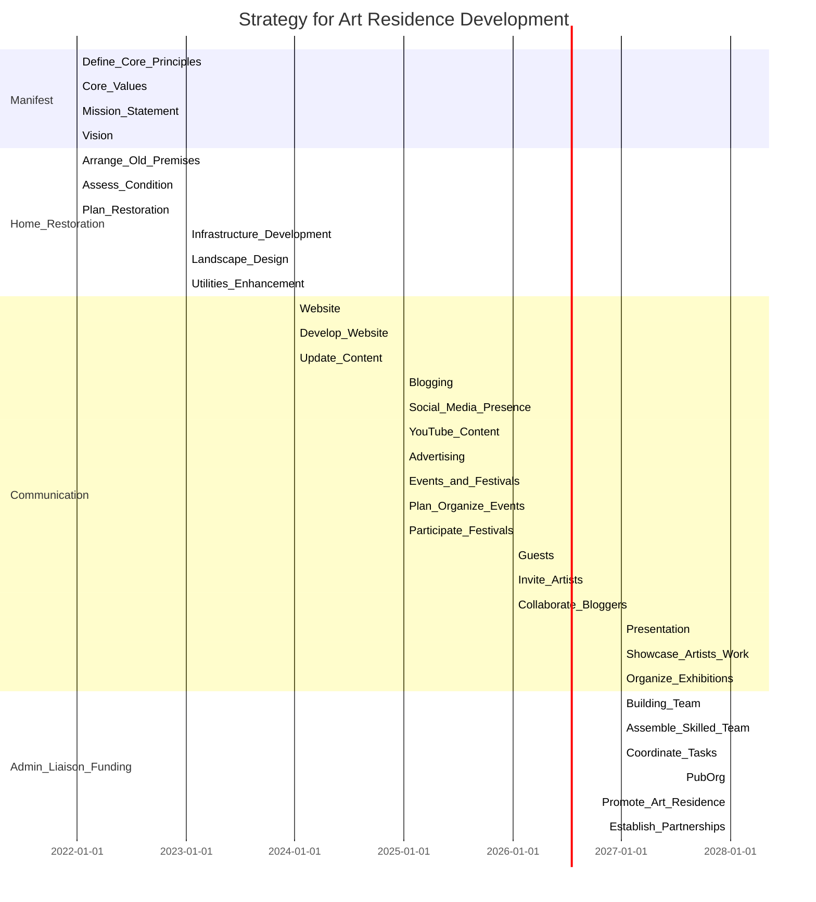
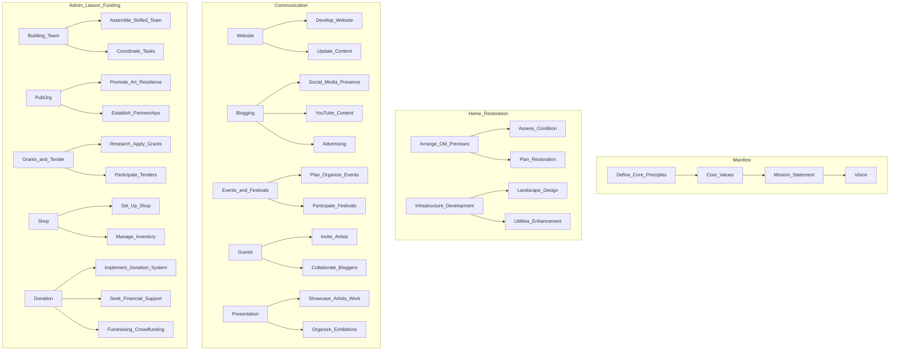

```mermaid
gantt
  title Strategy for Art Residence Development

  dateFormat YYYY
  section Manifest
    Define_Core_Principles :2022, 1yr
    Core_Values :2022, 1yr
    Mission_Statement :2022, 1yr
    Vision :2022, 1yr

  section Home_Restoration
    Arrange_Old_Premises :2022, 1yr
      Assess_Condition :2022, 6mo
      Plan_Restoration :2022, 6mo
    Infrastructure_Development :2023, 1yr
      Landscape_Design :2023, 6mo
      Utilities_Enhancement :2023, 6mo

  section Communication
    Website :2024, 1yr
      Develop_Website :2024, 6mo
      Update_Content :2024, 6mo
    Blogging :2025, 1yr
      Social_Media_Presence :2025, 4mo
      YouTube_Content :2025, 4mo
      Advertising :2025, 4mo
    Events_and_Festivals :2025, 1yr
      Plan_Organize_Events :2025, 6mo
      Participate_Festivals :2025, 6mo
    Guests :2026, 1yr
      Invite_Artists :2026, 6mo
      Collaborate_Bloggers :2026, 6mo
    Presentation :2027, 1yr
      Showcase_Artists_Work :2027, 6mo
      Organize_Exhibitions :2027, 6mo

  section Admin_Liaison_Funding
    Building_Team :2027, 1yr
      Assemble_Skilled_Team :2027, 6mo
      Coordinate_Tasks :2027, 6mo
    PubOrg :2028, 1yr
      Promote_Art_Residence :2028, 6mo
      Establish_Partnerships :2028, 6mo
```
# 2

```mermaid

graph TB
  subgraph Manifest
    Define_Core_Principles --> Core_Values
    Core_Values --> Mission_Statement
    Mission_Statement --> Vision
  end

  subgraph Home_Restoration
    Arrange_Old_Premises --> Assess_Condition
    Arrange_Old_Premises --> Plan_Restoration
    Infrastructure_Development --> Landscape_Design
    Infrastructure_Development --> Utilities_Enhancement
  end

  subgraph Communication
    Website --> Develop_Website
    Website --> Update_Content
    Blogging --> Social_Media_Presence
    Blogging --> YouTube_Content
    Blogging --> Advertising
    Events_and_Festivals --> Plan_Organize_Events
    Events_and_Festivals --> Participate_Festivals
    Guests --> Invite_Artists
    Guests --> Collaborate_Bloggers
    Presentation --> Showcase_Artists_Work
    Presentation --> Organize_Exhibitions
  end

  subgraph Admin_Liaison_Funding
    Building_Team --> Assemble_Skilled_Team
    Building_Team --> Coordinate_Tasks
    PubOrg --> Promote_Art_Residence
    PubOrg --> Establish_Partnerships
    Grants_and_Tender --> Research_Apply_Grants
    Grants_and_Tender --> Participate_Tenders
    Shop --> Set_Up_Shop
    Shop --> Manage_Inventory
    Donation --> Implement_Donation_System
    Donation --> Seek_Financial_Support
    Donation --> Fundraising_Crowdfunding
  end

    

```
