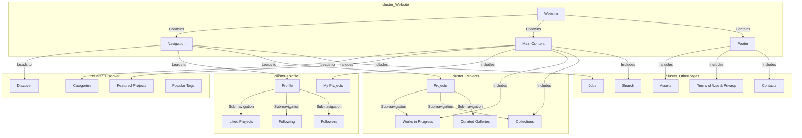

# Opus Website Block Scheme

```mermaid

graph TD;

subgraph cluster_Website
  A[Website]
  B[Navigation]
  C[Main Content]
  D[Footer]
end

subgraph cluster_Discover
  E[Discover]
  F[Categories]
  G[Featured Projects]
  H[Popular Tags]
end

subgraph cluster_Profile
  I[Profile]
  J[My Projects]
  K[Liked Projects]
  L[Following]
  M[Followers]
end

subgraph cluster_Projects
  N[Projects]
  O[Works in Progress]
  P[Collections]
  Q[Curated Galleries]
end

subgraph cluster_OtherPages
  R[Jobs]
  S[Search]
  T[Assets]
  U[Terms of Use & Privacy]
  V[Contacts]
end

A -->|Contains| B;
A -->|Contains| C;
A -->|Contains| D;
B -->|Leads to| E;
B -->|Leads to| I;
B -->|Leads to| N;
B -->|Leads to| R;
C -->|Includes| F;
C -->|Includes| G;
C -->|Includes| J;
C -->|Includes| O;
C -->|Includes| P;
C -->|Includes| S;
D -->|Includes| T;
D -->|Includes| U;
D -->|Includes| V;
I -->|Sub-navigation| K;
I -->|Sub-navigation| L;
I -->|Sub-navigation| M;
N -->|Sub-navigation| O;
N -->|Sub-navigation| P;
N -->|Sub-navigation| Q;


```

