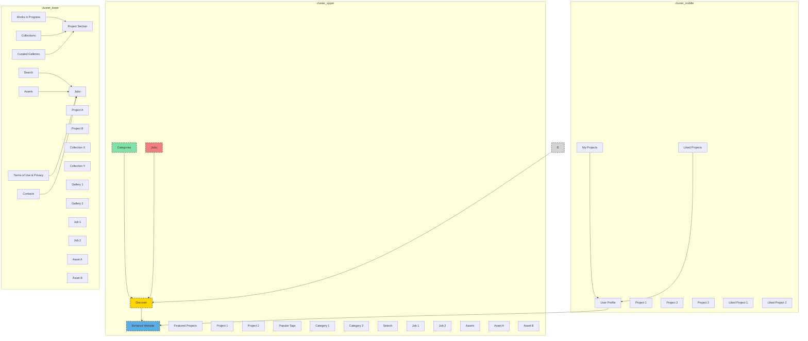

# Opus Website Block Scheme

```mermaid
flowchart TB;

style A fill:#5DADE2, stroke:#333, stroke-width:2px, stroke-dasharray: 5, 5, shape:rect;
style B fill:#FFD700, stroke:#333, stroke-width:2px, stroke-dasharray: 5, 5, shape:rect;
style C fill:#82E0AA, stroke:#333, stroke-width:2px, stroke-dasharray: 5, 5, shape:rect;
style D fill:#F08080, stroke:#333, stroke-width:2px, stroke-dasharray: 5, 5, shape:rect;
style E fill:#D3D3D3, stroke:#333, stroke-width:2px, stroke-dasharray: 5, 5, shape:rect;

subgraph cluster_upper
  A[Behance Website]
  B[Discover]
    BA[Featured Projects]
      BAA[Project 1]
      BAB[Project 2]
    BB[Popular Tags]
  C[Categories]
    CA[Category 1]
    CB[Category 2]
  D[Jobs]
    DA[Search]
      DAA[Job 1]
      DAB[Job 2]
    DB[Assets]
      DBA[Asset A]
      DBB[Asset B]
end

subgraph cluster_middle
  F[User Profile]
    G[My Projects]
      GA[Project 1]
      GB[Project 2]
      GC[Project 3]
    H[Liked Projects]
      HA[Liked Project 1]
      HB[Liked Project 2]
end

subgraph cluster_lower
  I[Project Section]
    IA[Works in Progress]
      IAA[Project A]
      IAB[Project B]
    IB[Collections]
      IBA[Collection X]
      IBB[Collection Y]
    IC[Curated Galleries]
      ICA[Gallery 1]
      ICB[Gallery 2]
  J[Jobs]
    JA[Search]
      JAA[Job 1]
      JAB[Job 2]
    JB[Assets]
      JBA[Asset A]
      JBB[Asset B]
    JC[Terms of Use & Privacy]
    JD[Contacts]
end

B --> A;
F --> A;

C & D & E --> B;
G & H --> F;
IA & IB & IC --> I;
JA & JB & JC & JD --> J;


```

