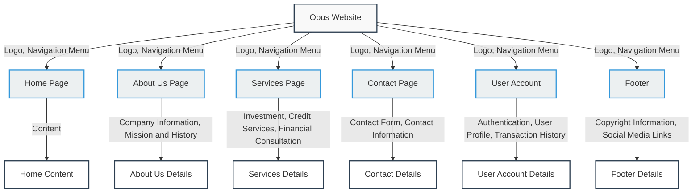

# Opus Website Block Scheme

```mermaid
graph TD

 style A fill:#f9f9f9,stroke:#2c3e50,stroke-width:2px;
  style B fill:#ecf0f1,stroke:#3498db,stroke-width:2px;
  style C fill:#ecf0f1,stroke:#3498db,stroke-width:2px;
  style D fill:#ecf0f1,stroke:#3498db,stroke-width:2px;
  style E fill:#ecf0f1,stroke:#3498db,stroke-width:2px;
  style F fill:#ecf0f1,stroke:#3498db,stroke-width:2px;
  style G fill:#ecf0f1,stroke:#3498db,stroke-width:2px;
  style H fill:#ffffff,stroke:#2c3e50,stroke-width:2px;
  style I fill:#ffffff,stroke:#2c3e50,stroke-width:2px;
  style J fill:#ffffff,stroke:#2c3e50,stroke-width:2px;
  style K fill:#ffffff,stroke:#2c3e50,stroke-width:2px;
  style L fill:#ffffff,stroke:#2c3e50,stroke-width:2px;
  style M fill:#ffffff,stroke:#2c3e50,stroke-width:2px;

A[Opus Website] -->|Logo, Navigation Menu| B[Home Page]
  A -->|Logo, Navigation Menu| C[About Us Page]
  A -->|Logo, Navigation Menu| D[Services Page]
  A -->|Logo, Navigation Menu| E[Contact Page]
  A -->|Logo, Navigation Menu| F[User Account]
  A -->|Logo, Navigation Menu| G[Footer]

  B -->|Content| H[Home Content]
  C -->|Company Information, Mission and History| I[About Us Details]
  D -->|Investment, Credit Services, Financial Consultation| J[Services Details]
  E -->|Contact Form, Contact Information| K[Contact Details]
  F -->|Authentication, User Profile, Transaction History| L[User Account Details]
  G -->|Copyright Information, Social Media Links| M[Footer Details]


```

