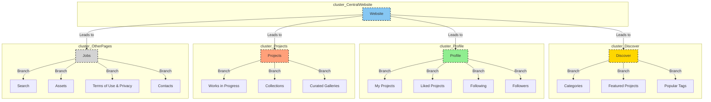

# Opus Website Block Scheme

```mermaid

graph TB;

style A fill:#86C7F3, stroke:#333, stroke-width:2px, stroke-dasharray: 5, 5;
style B fill:#FFD700, stroke:#333, stroke-width:2px, stroke-dasharray: 5, 5;
style F fill:#90EE90, stroke:#333, stroke-width:2px, stroke-dasharray: 5, 5;
style K fill:#FFA07A, stroke:#333, stroke-width:2px, stroke-dasharray: 5, 5;
style O fill:#D3D3D3, stroke:#333, stroke-width:2px, stroke-dasharray: 5, 5;

subgraph cluster_CentralWebsite
  A[Website]
end

subgraph cluster_Discover
  B[Discover]
  C[Categories]
  D[Featured Projects]
  E[Popular Tags]
end

subgraph cluster_Profile
  F[Profile]
  G[My Projects]
  H[Liked Projects]
  I[Following]
  J[Followers]
end

subgraph cluster_Projects
  K[Projects]
  L[Works in Progress]
  M[Collections]
  N[Curated Galleries]
end

subgraph cluster_OtherPages
  O[Jobs]
  P[Search]
  Q[Assets]
  R[Terms of Use & Privacy]
  S[Contacts]
end

A -->|Leads to| B;
A -->|Leads to| F;
A -->|Leads to| K;
A -->|Leads to| O;
B -->|Branch| C;
B -->|Branch| D;
B -->|Branch| E;
F -->|Branch| G;
F -->|Branch| H;
F -->|Branch| I;
F -->|Branch| J;
K -->|Branch| L;
K -->|Branch| M;
K -->|Branch| N;
O -->|Branch| P;
O -->|Branch| Q;
O -->|Branch| R;
O -->|Branch| S;

```

