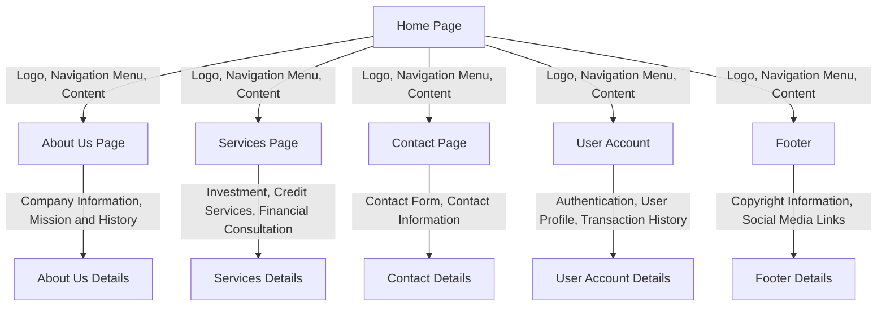

# Opus Website Block Scheme

```mermaid

graph TD
  A[Home Page] -->|Logo, Navigation Menu, Content| B[About Us Page]
  A -->|Logo, Navigation Menu, Content| C[Services Page]
  A -->|Logo, Navigation Menu, Content| D[Contact Page]
  A -->|Logo, Navigation Menu, Content| E[User Account]
  A -->|Logo, Navigation Menu, Content| F[Footer]

  B -->|Company Information, Mission and History| G[About Us Details]
  C -->|Investment, Credit Services, Financial Consultation| H[Services Details]
  D -->|Contact Form, Contact Information| I[Contact Details]
  E -->|Authentication, User Profile, Transaction History| J[User Account Details]
  F -->|Copyright Information, Social Media Links| K[Footer Details]


```

