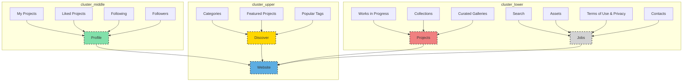

# Opus Website Block Scheme

```mermaid
graph TB;

style A fill:#5DADE2, stroke:#333, stroke-width:2px, stroke-dasharray: 5, 5, shape:rect;
style B fill:#FFD700, stroke:#333, stroke-width:2px, stroke-dasharray: 5, 5, shape:rect;
style F fill:#82E0AA, stroke:#333, stroke-width:2px, stroke-dasharray: 5, 5, shape:rect;
style K fill:#F08080, stroke:#333, stroke-width:2px, stroke-dasharray: 5, 5, shape:rect;
style O fill:#D3D3D3, stroke:#333, stroke-width:2px, stroke-dasharray: 5, 5, shape:rect;

subgraph cluster_upper
  A[Website]
  B[Discover]
  C[Categories]
  D[Featured Projects]
  E[Popular Tags]
end

subgraph cluster_middle
  F[Profile]
  G[My Projects]
  H[Liked Projects]
  I[Following]
  J[Followers]
end

subgraph cluster_lower
  K[Projects]
  L[Works in Progress]
  M[Collections]
  N[Curated Galleries]
  O[Jobs]
  P[Search]
  Q[Assets]
  R[Terms of Use & Privacy]
  S[Contacts]
end

B --> A;
F --> A;

C & D & E --> B;
G & H & I & J --> F;
L & M & N --> K;
P & Q & R & S --> O;
K & O --> A


```

