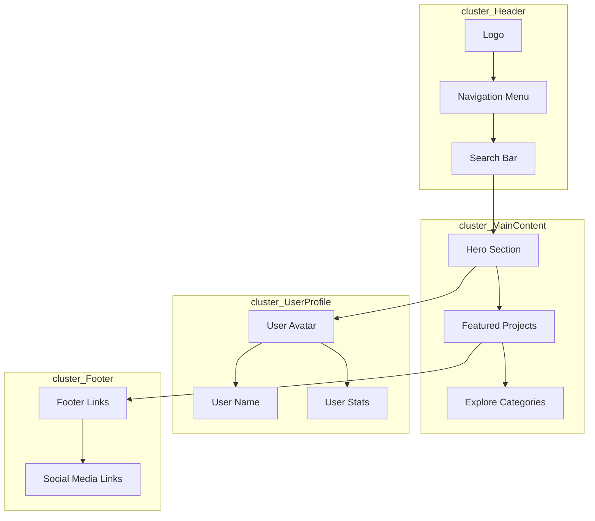

# Behance-Like Website Block Scheme

```mermaid

graph TB;

subgraph cluster_Header
  A[Logo]
  B[Navigation Menu]
  C[Search Bar]
end

subgraph cluster_MainContent
  D[Hero Section]
  E[Featured Projects]
  F[Explore Categories]
end

subgraph cluster_UserProfile
  G[User Avatar]
  H[User Name]
  I[User Stats]
end

subgraph cluster_Footer
  J[Footer Links]
  K[Social Media Links]
end

A --> B;
B --> C;
C --> D;
D --> E;
E --> F;
D --> G;
G --> H;
G --> I;
E --> J;
J --> K;


```

