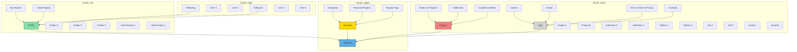

# Opus Website Block Scheme

```mermaid
graph TB;

style A fill:#5DADE2, stroke:#333, stroke-width:2px, stroke-dasharray: 5, 5, shape:rect;
style B fill:#FFD700, stroke:#333, stroke-width:2px, stroke-dasharray: 5, 5, shape:rect;
style F fill:#82E0AA, stroke:#333, stroke-width:2px, stroke-dasharray: 5, 5, shape:rect;
style K fill:#F08080, stroke:#333, stroke-width:2px, stroke-dasharray: 5, 5, shape:rect;
style O fill:#D3D3D3, stroke:#333, stroke-width:2px, stroke-dasharray: 5, 5, shape:rect;

subgraph cluster_upper
  A[Website]
  B[Discover]
  C[Categories]
  D[Featured Projects]
  E[Popular Tags]
end

subgraph cluster_left
  F[Profile]
    G[My Projects]
      GA[Project 1]
      GB[Project 2]
      GC[Project 3]
    H[Liked Projects]
      HA[Liked Project 1]
      HB[Liked Project 2]
end

subgraph cluster_right
  I[Following]
    IA[User 1]
    IB[User 2]
  J[Followers]
    JA[User 3]
    JB[User 4]
end

subgraph cluster_lower
  K[Projects]
    L[Works in Progress]
      LA[Project A]
      LB[Project B]
    M[Collections]
      MA[Collection X]
      MB[Collection Y]
    N[Curated Galleries]
      NA[Gallery 1]
      NB[Gallery 2]
  O[Jobs]
    P[Search]
      PA[Job 1]
      PB[Job 2]
    Q[Assets]
      QA[Asset A]
      QB[Asset B]
    R[Terms of Use & Privacy]
    S[Contacts]
end

B --> A;
F --> A;

C & D & E --> B;
G & H --> F;
I & J --> F;
L & M & N --> K;
P & Q & R & S --> O;
K & O --> A;


 

```

